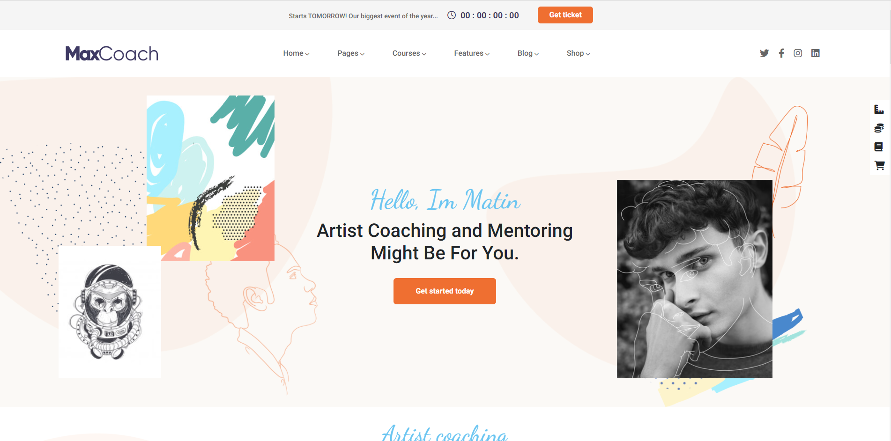

# PROGETTO HTML / VUE.js

> Riproduzione layout della sezione Artist del sito MaxCoach, solo versione desktop.

## TECNOLOGIE e LIBREIRE

- Html
- CSS
- Bootstrap
- Vue.js

## SVOLGIMENTO

1. Replica del layout con `Html` e `CSS` per la parte del `<main>`.
2. Aggiunta di `<header>` e `<footer>` tramite `Vue.js`.
